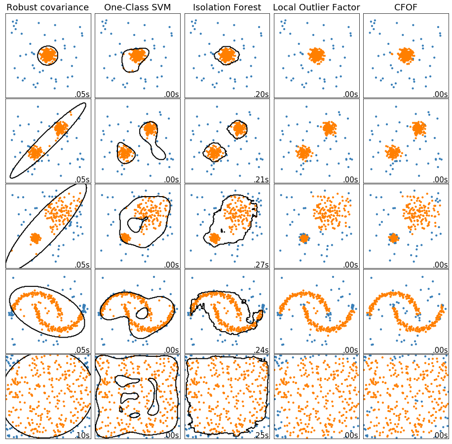

## Concentration Free Outlier Factor

### Why 
I've struggled to find open-source implementation of [this paper](https://arxiv.org/abs/1901.04992) by [Fabrizio Angiulli](http://siloe.dimes.unical.it/angiulli/), hence this repo.

The main property of the proposed approach is that it works equally well for high-dimensional data, which is not the case of other distance-based algorithms, like LOF. The problem with distance-based methods is in the curse of dimensionality, which makes it harder to discern neighbors, as "everything is far from everything else". Also, the scores of such algorithms get inflated as dimensionality grows. You can learn more in [this tutorial](https://www.dbs.ifi.lmu.de/~zimek/publications/ICDM2012/TutorialICDM2012-high-dim-outlier.pdf) by A.Zimek et al.

### Complexity

Neighbors are found in a naive way, giving overall O(n^2) algorithmic complexity.

### How to use

```python

from cfof import ConcentrationFreeOutlierFactor

model = ConcentrationFreeOutlierFactor(rho=0.01, contamination=.1)
outlier_labels = model.fit_predict(X) # -1 for outlier, 1 for inlier
```

### Comparison to other algorithms

Below is the comparison of different anomaly detection algorithms taken from [sklearn examples](https://scikit-learn.org/stable/auto_examples/plot_anomaly_comparison.html#sphx-glr-auto-examples-plot-anomaly-comparison-py).




### License

You're free to copy or modify everything you need.